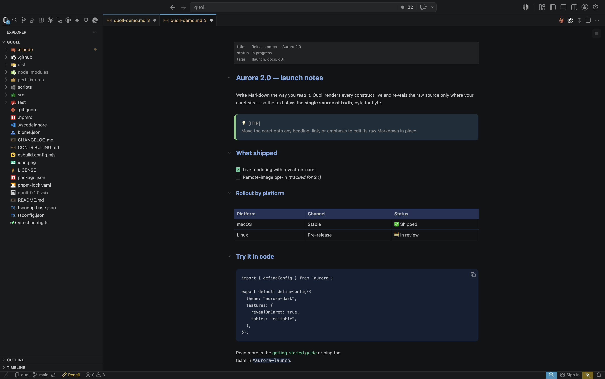

# Quoll

[](https://marketplace.visualstudio.com/items?itemName=mtskf.quoll)
[](https://marketplace.visualstudio.com/items?itemName=mtskf.quoll)
[](LICENSE)

Edit Markdown in VS Code with an Obsidian-style WYSIWYG editor, right inside your editor tabs.

- **Raw Markdown stays canonical** — the file on disk is always plain `.md`; Quoll renders it live and never rewrites your bytes.
- **Obsidian-style live-reveal** — move the caret into a construct to edit its Markdown source, and away to re-render.
- **Opt-in and non-intrusive** — registers with `priority: option`, so it never hijacks `.md` from your other editors.

<p align="center">
  
</p>

## Features

### Editing

- **WYSIWYG Markdown editing** — `.md` files open in a CodeMirror-based live editor. The raw Markdown stays canonical; move the caret into a construct to reveal and edit its source, and away to re-render.
- **Live editing** — edits sync to the document as you type; VS Code owns the file and saves as usual.
- **Interactive task lists** — toggle `- [ ]` / `- [x]` checkboxes directly in the rendered view.
- **Editable GFM tables** — render and edit tables from the Markdown source.

### Blocks & content

- **Rich blocks, rendered in place** — headings, lists, blockquotes, callouts (`[!TIP]`, `[!NOTE]`, …), images, and fenced code.
- **Frontmatter panel** — YAML frontmatter renders as a metadata block.
- **Fenced-code tools** — one-click copy; long blocks collapse behind a "Show more" bar.
- **Image paste & drop** — pasted or dropped images save under `./assets/` and insert a relative link (writable file-scheme documents).

### Navigation, lint & fit

- **Document outline** — a toggle-able overlay lists the document's headings; click one to jump straight to it. Open it with the top-right button or `Ctrl/Cmd+Alt+O`.
- **Switch to the text editor** — flip the active Markdown file to VS Code's built-in text editor (and back) with a top-right button or `⌘⌥E` (`Ctrl+Alt+E` on Windows/Linux); your caret position carries across.
- **Markdown lint** — advisory findings as inline underlines, with an optional gutter dot and an optional **Problems**-panel mirror.
- **Theme-aware & opt-in** — follows your light/dark theme, and registers with `priority: option` so it never hijacks `.md` from other extensions.

## Requirements

- VS Code `1.94.0` or newer.
- A trusted, local workspace. Quoll writes files via `WorkspaceEdit` and does not support untrusted or virtual workspaces.

## Install

Install from the [VS Code Marketplace](https://marketplace.visualstudio.com/items?itemName=mtskf.quoll):

- **Extensions view:** open the Extensions view (`Ctrl/Cmd+Shift+X`), search for **Quoll**, and click **Install**.
- **Quick Open:** press `Ctrl/Cmd+P` and run `ext install mtskf.quoll`.
- **Command line:** `code --install-extension mtskf.quoll`.

Prefer to build from source? Clone the repo and package the `.vsix` yourself:

```bash
git clone https://github.com/mtskf/quoll.git
cd quoll
pnpm install
pnpm package        # produces quoll-<version>.vsix
code --install-extension quoll-*.vsix
```

Reload the VS Code window after installing.

## Usage

`.md` files keep opening in your usual editor by default. Open one in Quoll explicitly:

- **Per file:** right-click a Markdown file → **Open With…** → **Markdown (Quoll)**.
- **As the default:** right-click → **Open With…** → **Configure default editor…** → pick **Markdown (Quoll)**.
- **From the palette:** run **Edit with Quoll** (`Ctrl/Cmd+Shift+P`) to open the active file in Quoll.

### Commands and keybindings

| Command              | Title                                      | Keybinding       | Notes                                      |
| -------------------- | ------------------------------------------ | ---------------- | ------------------------------------------ |
| `quoll.editWith`     | Edit with Quoll                            | —                | Opens the active file in the Quoll editor. |
| `quoll.toggleEditor` | Quoll: Toggle Between Rich and Text Editor | `⌘⌥E` / `Ctrl+Alt+E` | Swaps between Quoll and the text editor.   |

Two overlay affordances sit in the editor's top-right corner: a button to
toggle the **document outline** (`Ctrl/Cmd+Alt+O`) and a button to **switch to
the text editor** (`⌘⌥E` / `Ctrl+Alt+E`). Like the live-reveal below, the outline
toggle is editor-internal behavior rather than a VS Code command, so it does not
appear in the keybindings UI.

Inline formatting is plain Markdown — type `**bold**`, `*italic*`, or
`` `code` `` and the editor live-renders it. Move the caret into a
construct to reveal its raw Markdown markers for editing; move the caret
away to re-render. This live-reveal is editor-internal behavior rather than
a set of VS Code commands, so it does not appear in the keybindings UI.

## Settings

Quoll contributes two settings (Settings UI → search "Quoll", or `settings.json`):

- `quoll.lint.problems.enabled` (default `true`) — mirror Quoll's advisory
  Markdown lint findings into VS Code's **Problems** panel. Turning it off
  clears those entries and suppresses new ones; the in-editor underlines stay on.
- `quoll.lint.gutter.enabled` (default `false`) — show a severity-coloured dot
  in a thin left gutter on each line that has an advisory lint finding. Off by
  default so the clean centred reading column is unchanged; turning it on adds
  the gutter without touching the underlines or the Problems mirror.

## Known limitations

Quoll is early software. Be aware of the following before relying on it:

- **Markdown round-trips byte-for-byte.** The raw text is canonical, so what you edit equals what's on disk for every construct.
  - *Line endings:* a file that mixes CRLF/LF, or is CR-only, is shown with one normalized separator (VS Code normalizes on load); opening and saving it without edits leaves the on-disk bytes unchanged.
  - *Unsafe URLs:* the write-gate refuses to save (a "Cannot save" notice) until an out-of-allowlist link/image destination is fixed — see Images.
- **Raw HTML is shown as inert source** — displayed as its source, never rendered as live HTML, and preserved byte-for-byte on save. Open with the default text editor for raw-HTML syntax highlighting.
- **Images have partial support.**
  - Relative images (``) resolve against the document folder and render for **file-scheme** documents only; untitled/git-scheme documents show inert placeholders.
  - Paste or drop into a writable file-scheme document saves under `./assets/` as a content-hashed PNG/JPEG/GIF/WebP (10 MB cap, type sniffed host-side); read-only documents ignore it.
  - Images outside the document folder (`../sibling/img.png`) and remote (`https://…`) images are not loaded (`localResourceRoots` scope + CSP); a remote-image opt-in is tracked for a follow-up.
  - *URL allowlist:* link/image/autolink destinations pass only when schemeless (relative or `#fragment`) or `http:` / `https:` / `mailto:`. Everything else (`javascript:`, `data:`, `file:`, protocol-relative `//host`, control chars) renders an inert placeholder and blocks the save until fixed. The check is by scheme name and covers Markdown destinations only — URLs inside raw HTML aren't checked.
- **MDX (`.mdx`) is not supported** — only `.md` files open with the rich editor.
- **Not implemented:** slash/block-insert menu (no UI to insert tables / lists / headings from scratch), column resizing for tables, diff/git views, and collaborative editing. Single file, single editor only.
- **Visual rendering is verified by manual smoke.** Automated tests cover the CodeMirror decoration/widget behavior, GFM table round-trips, the host write-gate, the message protocol, and host-side message flows (a `@vscode/test-electron` E2E suite); in-webview visual rendering is not asserted by CI and is checked by manual smoke.

## Contributing

Contributions are welcome. The project is a single-root pnpm package (extension host + webview bundled together via esbuild).

```bash
pnpm install        # install all deps
pnpm build          # full build (tsc + esbuild → dist/)
pnpm package        # produce a .vsix via vsce
pnpm test           # run the vitest unit suite
```

Press `F5` in VS Code to launch an Extension Development Host with Quoll loaded. See [CONTRIBUTING.md](CONTRIBUTING.md) for the full contributor guide.

Found a bug or have a feature request? [Open an issue](https://github.com/mtskf/quoll/issues/new/choose).

## License

[MIT](LICENSE) — © 2026 Mitsuki Fukunaga and Quoll contributors.
