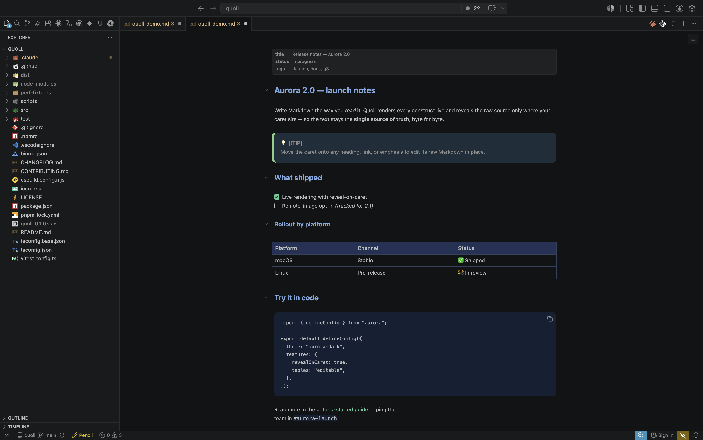
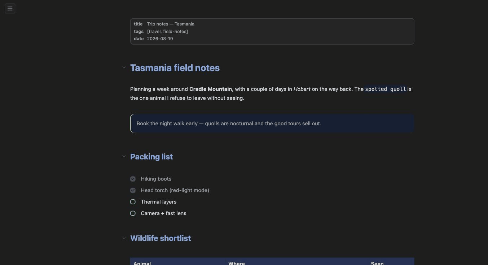
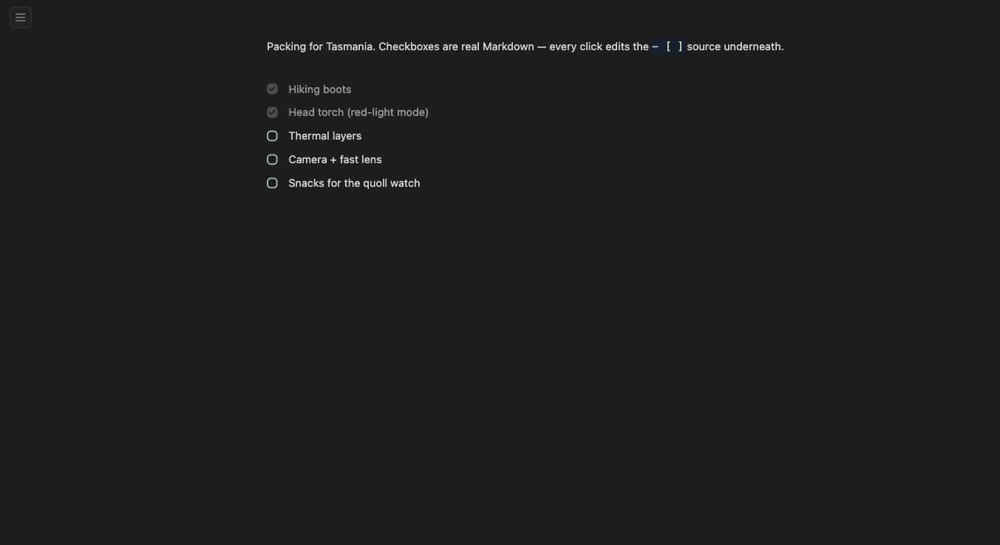
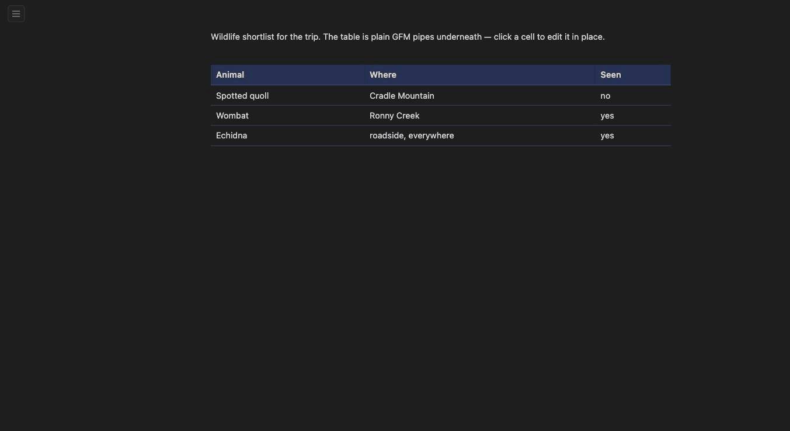
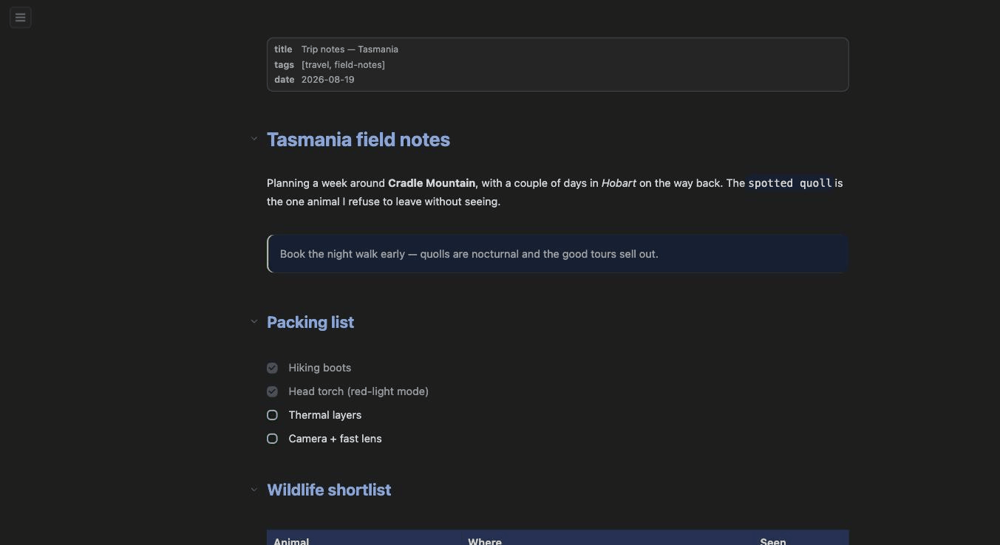

<p align="center">
  
</p>

# Quoll

> Edit Markdown in VS Code with an Obsidian-style WYSIWYG editor, right inside your editor tabs.

[](https://marketplace.visualstudio.com/items?itemName=mtskf.quoll)
[](https://marketplace.visualstudio.com/items?itemName=mtskf.quoll)
[](https://marketplace.visualstudio.com/items?itemName=mtskf.quoll&ssr=false#review-details)
[](https://open-vsx.org/extension/mtskf/quoll)
[](LICENSE)

<p align="center">
  
</p>

## Why Quoll?

- **Your Markdown stays yours.** The raw text is the only source of truth — every construct round-trips byte-for-byte, with no hidden transforms and no lock-in. What you edit is exactly what lands on disk.
- **Private by design.** No telemetry, no background network requests. A default-deny content security policy keeps the editor fully local (local images only).
- **A good neighbour.** Quoll registers as an opt-in editor, so it never hijacks `.md` from your other extensions. Open it per file, or make it your default when you're ready.

## Features

### Live editing, raw Markdown underneath

Move the caret into any construct to reveal its source; move away and it re-renders. Type plain Markdown — `**bold**`, `*italic*`, `` `code` `` — and watch it render as you go. Edits sync to the document as you type; VS Code owns the file and saves as usual.

<p align="center">
  
</p>

### Interactive task lists

Toggle `- [ ]` / `- [x]` checkboxes directly in the rendered view — by click, or with `Ctrl/Cmd+L` when the caret is on the task's line. Every click is a real edit to the source.

<p align="center">
  
</p>

### Editable GFM tables

Tables render from plain GFM pipes. Click a cell to drop into the source, edit it, and click away to re-render.

<p align="center">
  
</p>

### Document outline

A toggle-able overlay lists the document's headings — click one to jump straight to it, or collapse a chevron to fold its sub-headings. Open it with the top-left button or `Ctrl/Cmd+Alt+O`.

<p align="center">
  
</p>

### And the rest

- **Familiar formatting shortcuts** — `⌘B` bold, `⌘I` italic, `⌘E` code, `⌘K` link, `⌘⇧X` strikethrough (Ctrl on Windows/Linux), plus a whole-document formatter.
- **Rich blocks, rendered in place** — headings, lists, blockquotes, callouts (`[!TIP]`, `[!NOTE]`, …), images, and fenced code.
- **Frontmatter panel** — YAML frontmatter renders as a metadata block.
- **Fenced-code tools** — one-click copy; long blocks collapse behind a "Show more" bar.
- **Image paste & drop** — pasted or dropped images save under `./assets/` and insert a relative link.
- **Switch between rich and text** — flip between Quoll and the built-in text editor with `⌘⌥E` (`Ctrl+Alt+E`), carrying your caret across.
- **Markdown lint & spellcheck** — advisory findings as inline underlines, with an optional gutter dot, an optional **Problems**-panel mirror, opt-in prose-style hints, and native spellcheck.
- **Tune the reading surface** — font family, size, line height, and column width, from the outline sidebar's Settings popover or `settings.json`.
- **Theme-aware** — follows your light/dark/high-contrast theme.

## Requirements

- VS Code `1.94.0` or newer.
- A trusted, local workspace. Quoll writes files via `WorkspaceEdit` and does not support untrusted or virtual workspaces.

## Install

Install from the [VS Code Marketplace](https://marketplace.visualstudio.com/items?itemName=mtskf.quoll) or [Open VSX](https://open-vsx.org/extension/mtskf/quoll):

- **Extensions view:** open the Extensions view (`Ctrl/Cmd+Shift+X`), search for **Quoll**, and click **Install**.
- **Quick Open:** press `Ctrl/Cmd+P` and run `ext install mtskf.quoll`.
- **Command line:** `code --install-extension mtskf.quoll`.

Prefer to build from source? Clone the repo and package the `.vsix` yourself:

```bash
git clone https://github.com/mtskf/quoll.git
cd quoll
pnpm install
pnpm package        # produces quoll-<version>.vsix
code --install-extension quoll-*.vsix
```

Reload the VS Code window after installing.

## Usage

`.md` files keep opening in your usual editor by default. Open one in Quoll explicitly:

- **Per file:** right-click a Markdown file → **Open With…** → **Markdown (Quoll)**.
- **As the default:** right-click → **Open With…** → **Configure default editor…** → pick **Markdown (Quoll)**.
- **From the palette:** run **Edit with Quoll** (`Ctrl/Cmd+Shift+P`) to open the active file in Quoll.

### Commands and keybindings

| Command              | Title                                      | Keybinding       | Notes                                      |
| -------------------- | ------------------------------------------ | ---------------- | ------------------------------------------ |
| `quoll.editWith`     | Edit with Quoll                            | —                | Opens the active file in Quoll; also the **cat**-icon title-bar button on a Markdown text editor. |
| `quoll.toggleEditor` | Quoll: Toggle Between Rich and Text Editor | `⌘⌥E` / `Ctrl+Alt+E` | Swaps between Quoll and the text editor, carrying your caret position across. |
| `quoll.reopenInTextEditor` | Quoll: Reopen in Text Editor         | —                | Reopens the current document in the built-in text editor; also the **file-code**-icon title-bar button on Quoll. |
| `quoll.format`       | Quoll: Format Selection (bold / italic / code / strike / link) | `⌘B` / `⌘I` / `⌘E` / `⌘⇧X` / `⌘K` (Ctrl on Windows/Linux) | Wraps the selection with the chosen inline format inside Quoll. |
| `quoll.formatDocument` | Quoll: Format Document                   | —                | Normalizes Markdown formatting across the whole document. |

Two more overlay buttons sit in the editor's top-right corner: toggle the **document outline** (`Ctrl/Cmd+Alt+O`) and **switch to the text editor** (`⌘⌥E`). The outline toggle and the caret live-reveal are editor-internal behaviour rather than VS Code commands, so they do not appear in the keybindings UI.

## Settings

Settings UI → search "Quoll", or `settings.json`. The editor-surface settings are also reachable from the outline sidebar's Settings popover.

Lint & spellcheck:

- `quoll.lint.problems.enabled` (default `true`) — mirror advisory lint findings into VS Code's **Problems** panel; the in-editor underlines stay on either way.
- `quoll.lint.gutter.enabled` (default `false`) — severity-coloured dot in a thin left gutter on lines with a lint finding.
- `quoll.lint.prose.enabled` (default `false`) — opt-in writing-style hints (passive voice, filler words, over-long sentences) as info-level squiggles.
- `quoll.editor.spellcheck` (default `true`) — native spellchecker on the editing surface.

Reading surface:

- `quoll.editor.fontFamily` (default `default`) — inherit your VS Code font, or a curated serif / sans reading font.
- `quoll.editor.fontSize`, `quoll.editor.lineHeight`, `quoll.editor.contentWidth` — size, spacing, and reading-column width.

## Known limitations

Quoll is early software. Be aware of the following before relying on it:

- **Raw HTML is shown as inert source** — displayed as-is, never rendered as live HTML, and preserved byte-for-byte on save.
- **Images have partial support.** Relative images (``) render for **file-scheme** documents only. Paste/drop saves a content-hashed PNG/JPEG/GIF/WebP under `./assets/` (10 MB cap, type sniffed host-side). Images outside the document folder and remote (`https://…`) images are not loaded (CSP scope); a remote-image opt-in is tracked for a follow-up.
- **Unsafe URLs block saving.** Link/image destinations pass only when schemeless (relative or `#fragment`) or `http:` / `https:` / `mailto:`. Anything else (`javascript:`, `data:`, `file:`, protocol-relative `//host`) renders inertly and blocks the save with a "Cannot save" notice until fixed. The check covers Markdown destinations only — URLs inside raw HTML aren't checked.
- **Line endings:** a file that mixes CRLF/LF is shown with one normalized separator (VS Code normalizes on load); opening and saving it without edits leaves the on-disk bytes unchanged.
- **MDX (`.mdx`) is not supported** — only `.md` files open with the rich editor.
- **Not implemented:** slash/block-insert menu, column resizing for tables, diff/git views, and collaborative editing. Single file, single editor only.
- **Visual rendering is verified by manual smoke.** Automated tests cover the editing logic (round-trips, write-gate, message protocol, host E2E flows); in-webview visual rendering is not asserted by CI.

## Contributing

Contributions are welcome. The project is a single-root pnpm package (extension host + webview bundled together via esbuild).

```bash
pnpm install        # install all deps
pnpm build          # full build (tsc + esbuild → dist/)
pnpm package        # produce a .vsix via vsce
pnpm test           # run the vitest unit suite
```

Press `F5` in VS Code to launch an Extension Development Host with Quoll loaded. See [CONTRIBUTING.md](CONTRIBUTING.md) for the full contributor guide.

Found a bug or have a feature request? [Open an issue](https://github.com/mtskf/quoll/issues/new/choose).

## License

[MIT](LICENSE) — © 2026 Mitsuki Fukunaga and Quoll contributors.
